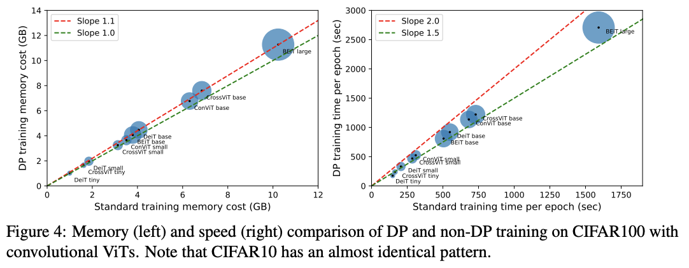

# private_vision

This Pytorch codebase implements efficient training of differentially private (DP) vision neural networks (CNN, including convolutional Vision Transformers), using [mixed ghost per-sample gradient clipping](https://arxiv.org/pdf/2205.10683.pdf).

<p align="center">
  
</p>

## ❓ What is this?
There are a few DP libraries that change the regular non-private training of neural networks to a privacy-preserving one. Examples include [Opacus](https://github.com/pytorch/opacus/blob/main/Migration_Guide.md#if-youre-using-virtual-steps), [FastGradClip](https://github.com/ppmlguy/fastgradclip), [private-transformers](https://github.com/lxuechen/private-transformers), and [tensorflow-privacy](https://github.com/tensorflow/privacy).

However, they are not suitable for DP training of large CNNs, because they are either not generalizable or computationally inefficient. E.g. causing >20 times memory burden or >5 times slowdown than the regular training.

<p align="center">
  
</p>

This codebase implements a new technique --**the mixed ghost clipping**-- for the convolutional layers, that substantially reduces the space and time complexity of DP deep learning.

## 🔥 Highlights
* We implement a mixed ghost clipping technique for the Conv1d/Conv2d/Conv3d layers, that trains DP CNNs almost as light as (with 0.1%-10% memory overhead) the regular training. This allows us to train 18 times larger batch size on VGG19 and CIFAR10 than Opacus, as well as to train efficiently on ImageNet (224X224) or larger images, which easily cause out of memory error with private-transformers.
* Larger batch size can improve the throughput of mixed ghost clipping to be 3 times faster than existing DP training methods. On all models we tested, the slowdown is at most 2 times to the regular training.
* We support general optimizers and clipping functions. Loading vision models from codebases such as [timm](https://github.com/rwightman/pytorch-image-models) and [torchvision](https://pytorch.org/vision/stable/models.html), our method can privately train VGG, ResNet, Wide ResNet, ResNeXt, etc. with a few additional lines of code. 
* We demonstrate DP training of convolutional Vision Transformers (up to 300 million parameters, again 10% memory overhead and less than 200% slowdonw than non-private training). We improve from previous SOTA 67.4% accuracy to **83.0% accuracy at eps=1 on CIFAR100**, and to **96.7% accuracy at eps=1 on CIFAR10**.

<p align="center">
  
</p>

## :beers: Examples
To DP training models on CIFAR10 and CIFAR100, one can run
```bash
python -m cifar_DP --lr 0.001 --epochs 3 --model beit_large_patch16_224
```


Arguments:
- `--lr`: learning rate, default is 0.001
- `--epochs`: number of epochs, default is 1 
- `--model`: name of models in [timm](https://github.com/rwightman/pytorch-image-models/tree/master/timm/models), default is `resnet18`; see supported models below
- `--cifar_data`: dataset to train, `CIFAR10` (default) or `CIFAR100`
- `--eps`: privacy budget, default is 2
- `--grad_norm`: per-sample gradient clipping norm, default is 0.1 
- `--mode`: which DP clipping algorithm to use, one of `ghost_mixed`(default; the mixed ghost clipping), `ghost` (the ghost clipping), `non-ghost` (the Opacus approach), `non-private` (standard non-DP training)
- `--bs`: logical batch size that determines the convergence and accuracy, but not the memory nor speed; default is 1000 
- `--mini_bs`: virtual or physical batch size for the gradient accumulation, which determines the memory and speed of training; default is 50
- `--pretrained`: whether to use pretrained model from `timm`, default is True
  

## 🚀 Getting Started

Privately training vision models is simple:

1. Create the model and any optimizer
2. Attach this optimizer to our `PrivacyEngine` (this essentially adds Pytorch hooks for per-sample clipping)
3. Compute per-example losses (setting `reduction=='none'`) for a mini-batch of data
4. Pass the loss to `optimizer.step` or `optimizer.virtual_step` without calling the `backward` function (this is implicitly called inside `PrivacyEngine`)


Below is a quick example of using our codebase for training CNN models with mixed ghost clipping:

```python
import torchvision, torch, opacus
from private_vision import PrivacyEngine

model = torchvision.models.resnet18()

# replace BatchNorm by GroupNorm or LayerNorm
model=opacus.validators.ModuleValidator.fix(model)

optimizer = torch.optim.Adam(params=model.parameters(), lr=1e-4)
privacy_engine = PrivacyEngine(
    model,
    batch_size=256,
    sample_size=50000,
    epochs=3,
    max_grad_norm=0.1,
    target_epsilon=3,
    ghost_clipping=True,
    mixed=True,
    )
privacy_engine.attach(optimizer)

# Same training procedure, e.g. data loading, forward pass, logits...
loss = F.cross_entropy(model(batch), labels, reduction="none")
# do not use loss.backward()
optimizer.step(loss=loss)
```

In the above `PrivacyEngine`,
* setting `ghost_clipping=True, mixed=True` implements the best method, mixed ghost clipping; 
* setting keywords `ghost_clipping=True, mixed=False` implements the ghost clipping, which are very memory-costly for large images (e.g. failing to fit a single 400X400 image into ResNet18 with a 16GB GPU); 
* setting `ghost_clipping=False` implements a similar approach to Opacus, which needs to instantiate the per-sample gradients that are very memory-costly.

A special use of our privacy engine is to use the gradient accumulation. This is achieved with virtual step function.

```python
import torchvision, torch
from private_vision import PrivacyEngine

gradient_accumulation_steps = 10  

# Batch size/physical batch size. Take an update once this many iterations

model = torchvision.models.resnet18()
model=opacus.validators.ModuleValidator.fix(model)
optimizer = torch.optim.Adam(model.parameters())
privacy_engine = PrivacyEngine(...)
privacy_engine.attach(optimizer)

for i, batch in enumerate(dataloader):
    loss = F.cross_entropy(model(batch), labels, reduction="none")
    if i % gradient_accumulation_steps == 0:
        optimizer.step(loss=loss)
        optimizer.zero_grad()
    else:
        optimizer.virtual_step(loss=loss)
```

## :clipboard: Currently Supported Modules
* nn.Linear (2D [Ian Goodfellow](https://arxiv.org/abs/1510.01799))
* nn.Linear (3D [Xuechen et al.](https://arxiv.org/abs/2110.05679))
* nn.LayerNorm ([Opacus](https://arxiv.org/abs/2109.12298))
* nn.GroupNorm ([Opacus](https://arxiv.org/abs/2109.12298))
* nn.Embedding ([Xuechen et al.](https://arxiv.org/abs/2110.05679))
* nn.Conv1d (this work)
* nn.Conv2d (this work)
* nn.Conv3d (this work)
* nn.Linear (4D; this work)

For unsupported modules, an error message will print out the module names and you need to mannually freeze them to not require gradient.

As a consequence, we can privately train most of the models from `timm` (this list is non-exclusive):
```python
...
```
We also support models in `torchvision` and other vision libraries.

<!--
##  :warning: Caution
* **Batch normalization does not satisfy DP.** This is because the mean and variance of batch normalization is computed from data without privatization. To train DP networks, replace batch normalization with group/instance/layer normalization. [Opacus (>v1.0)](https://github.com/pytorch/opacus/blob/main/tutorials/guide_to_module_validator.ipynb) provides an easy fixer for this replacement via `opacus.validators.ModuleValidator.fix`, but you can also change the normalization layer manually. 
* **Extra care needed for sampling.** Taking virtual step with fixed virtual batch size is not compatible with Poisson sampling. [Opacus] provides `BatchMemoryManager` to feature this [sampling issue](https://github.com/pytorch/opacus/blob/main/Migration_Guide.md#if-youre-using-virtual-steps) and our mixed ghost clipping can be merged easily. Also we didn't use secure PRNG to sample the noise for this experimental codebase.
-->

## Citation
Please cite our paper if you use private_vision in your papers, as follows:
```
@article{bu2022scalable,
  title={Scalable and Efficient Training of Large Convolutional Neural Networks with Differential Privacy},
  author={Bu, Zhiqi and Mao, Jialin and Xu, Shiyun},
  journal={arXiv preprint arXiv:2205.10683},
  year={2022}
}
```

## Acknowledgement
This code is largely based on https://github.com/lxuechen/private-transformers (v0.1.0) and https://github.com/pytorch/opacus (v0.15).
